## 从零开始机器学习

### 1 入门篇（可略过）

这块旨在成为名词党，逢人便能唠两句，对AI方向完全不了解的小伙伴可以当故事看看

以下概念将被涉及

* 人工智能
* 机器学习
* 统计学习
* 符号主义
* 专家系统
* 深度学习
* 神经网络
* 反向传播
* 知识图谱
* 推荐系统
* 数据挖掘
* 特征工程
* 自然语言处理
* 计算机视觉
* 卷积
* 贝叶斯学派
* 马尔克夫链
* 决策树
* 随机森林

#### 1.1 发展史

#### 1.2 名词解释

#### 1.3 安装IDE

图文来自我之前的python文章（故可能和本文不是特别搭配）

##### 1.3.1 安装anacanda

anacanda是一个开源的python发行版本，集成了一下常用工具，如：jupyter notebook、NumPy等，相当于一个python全家桶

我们可以去它的官网上，下载最新版本
https://www.anaconda.com/products/individual

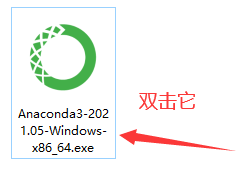

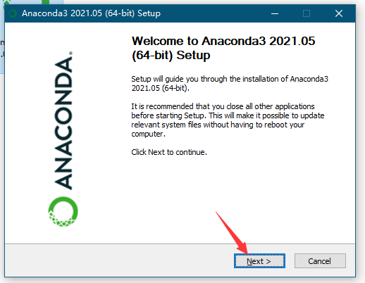
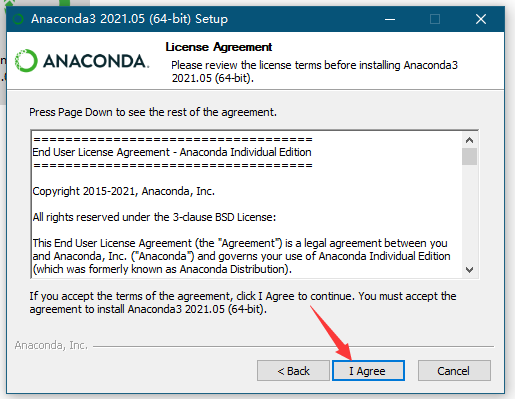
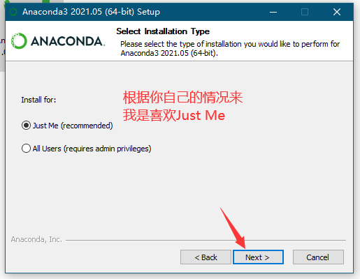
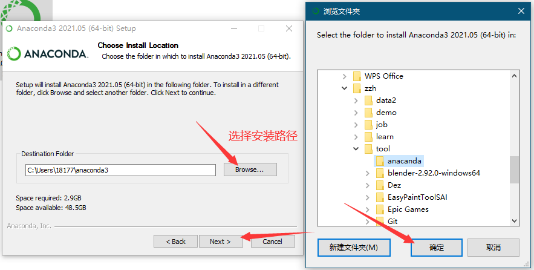
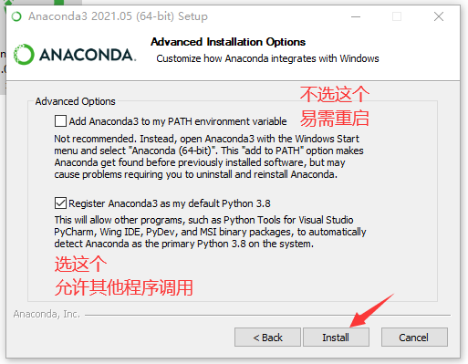
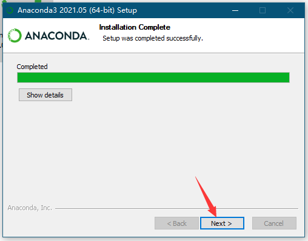
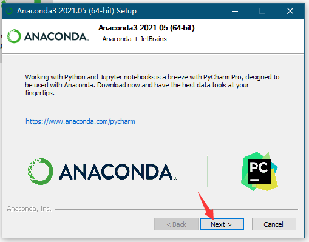
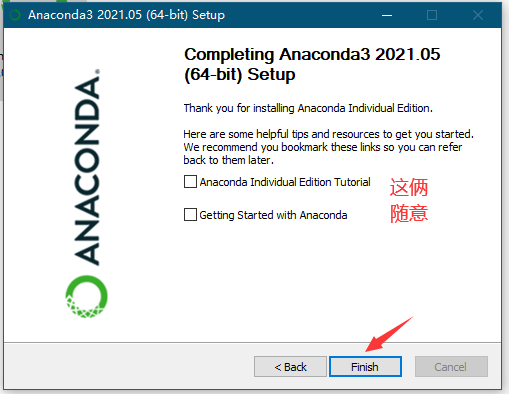


##### 1.3.2 启动Jupyter Notebook

我们的代码会在这上面编写（yin）

##### 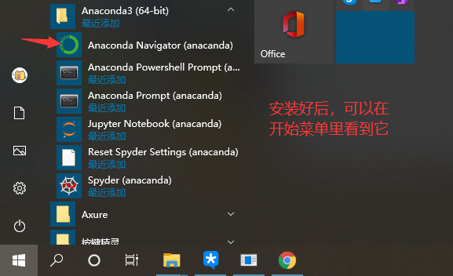
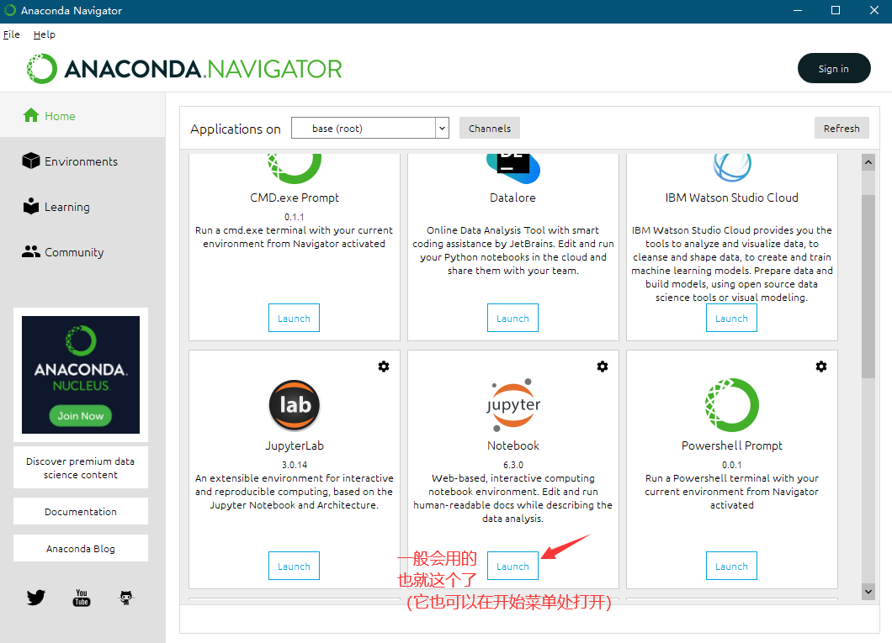
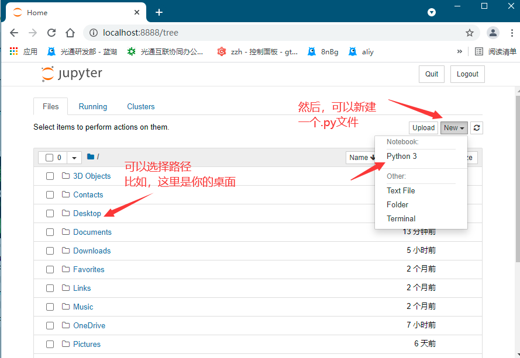
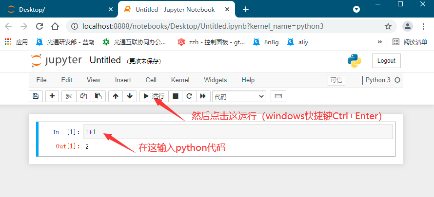


##### 1.3.3 配置环境变量

通过pip（python的包管理工具，装python时会自带，无需特定安装）可以安装各类库（相当于node.js中的npm）
（如果pip行不通，可以试试pip3）

```
pip install pywebview
```

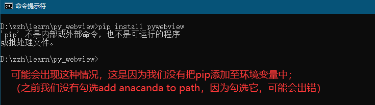
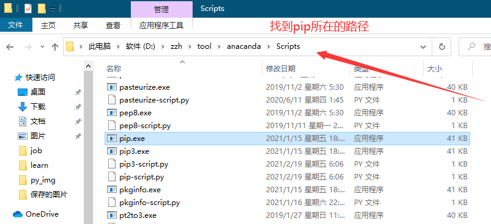
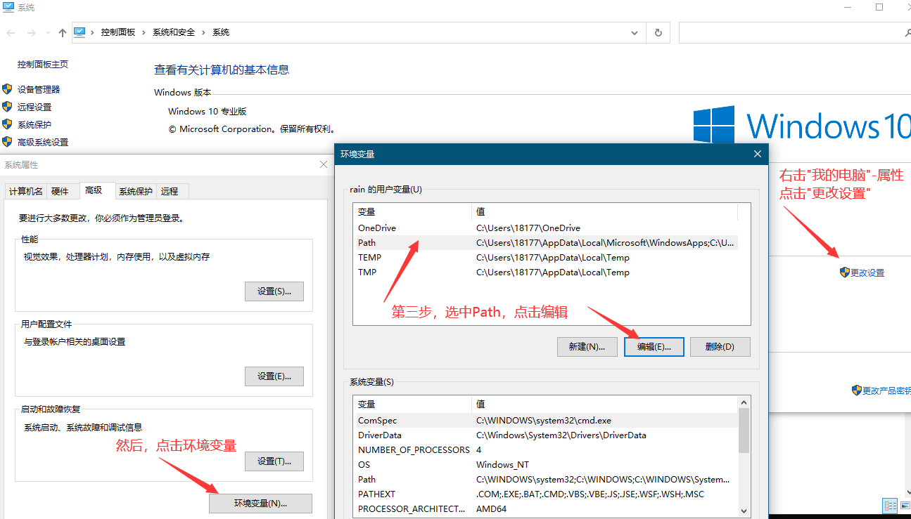
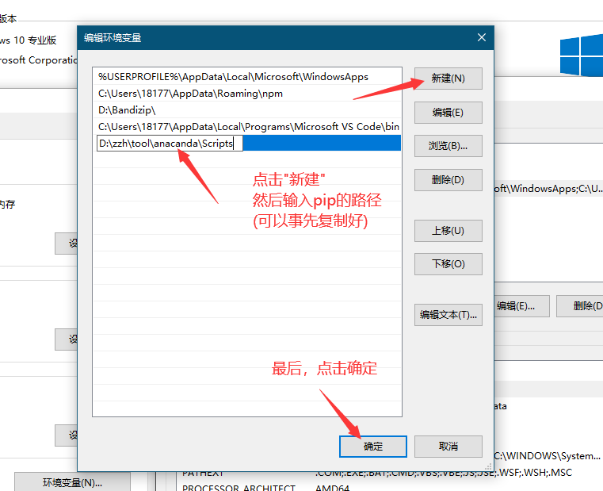

然后再运行`pip install pywebview`
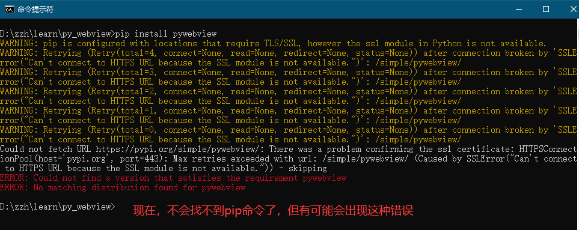

https://slproweb.com/products/Win32OpenSSL.html
去这里下载一个东西就好了

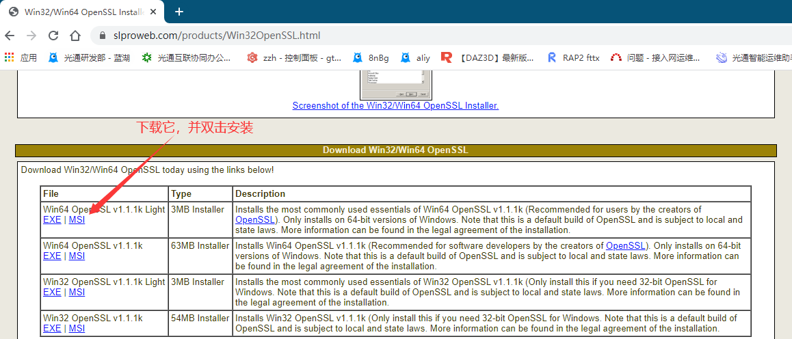

再运行`pip install pywebview`


现在，就成功安装pywebview了

此时，新建一个python文件，然后编写代码

```
import webview

webview.create_window('Title', html='<h1>hello world</h1>')
webview.start()
```

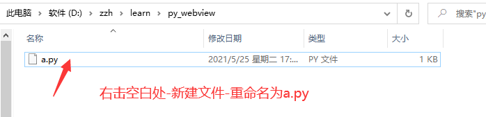

编写好后，在(同级目录下的)终端运行它

```
python a.py
```

此时，你有可能需要将python也添加至环境变量

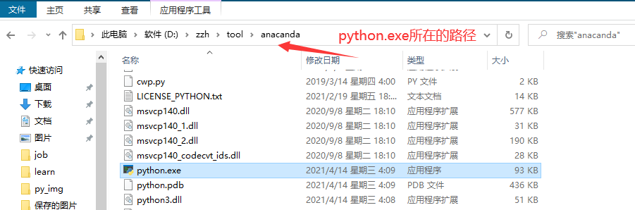
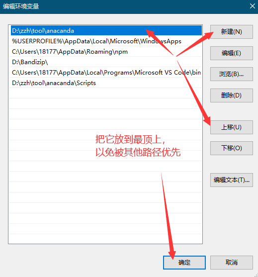

然后运行`python a.py`就好了


### 2 小试牛刀

#### 2.1 K近邻算法

#### 2.2 线性规划法

#### 2.3 梯度下降法

##### 2.3.1 梯度与矩阵

